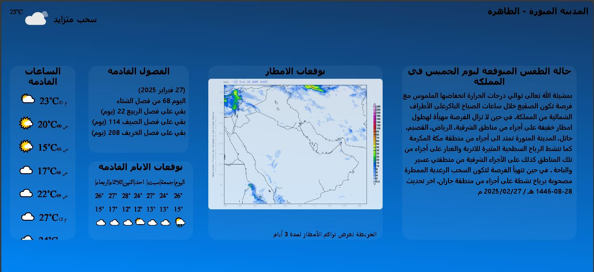
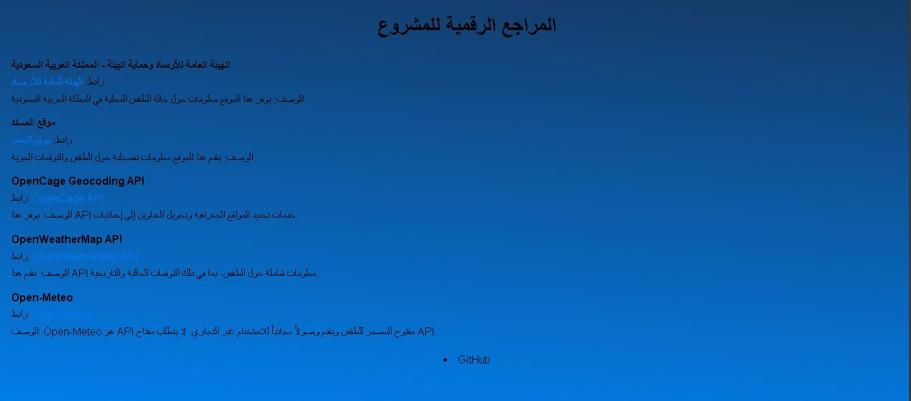
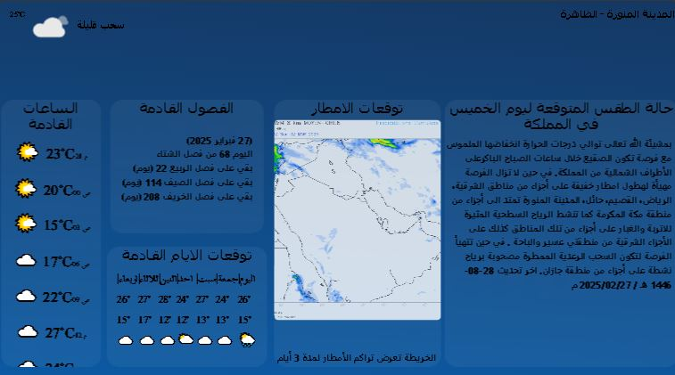
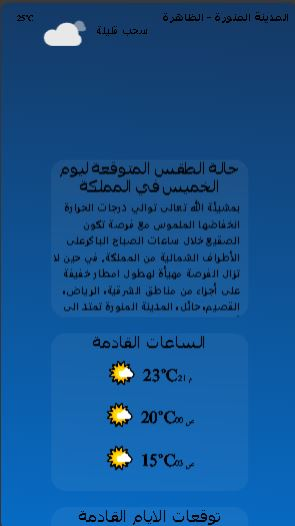

# "WeatherNow ⛅🌍

* https://weather-990.web.app/ 

"مرحبًا بك في تطبيق الطقس! ⛅🌍✨  "  

هذا تطبيق بسيط يعتمد على api  و بعض طرق استخراج المعلومات من صفحات الويب ..
الفكرة يعرض لك بطاقات كل بطاقة فيه خصائص 

مثل بطاقة الساعات القادمة و الفصول القادمه 

   

#  واجهات الموقع 

&nbsp;&nbsp;&nbsp; 
&nbsp;&nbsp;&nbsp; 
&nbsp;&nbsp;&nbsp; 
&nbsp;&nbsp;&nbsp; 

&nbsp;&nbsp;&nbsp; 
&nbsp;&nbsp;&nbsp; 
&nbsp;&nbsp;&nbsp; 
&nbsp;&nbsp;&nbsp; 
&nbsp;&nbsp;&nbsp; 
&nbsp;&nbsp;&nbsp; 

 &nbsp;&nbsp;&nbsp; 
 &nbsp;&nbsp;&nbsp; 
 &nbsp;&nbsp;&nbsp; 
 &nbsp;&nbsp;&nbsp; 
 &nbsp;&nbsp;&nbsp; &nbsp;&nbsp;&nbsp; 
 &nbsp;&nbsp;&nbsp; 

 &nbsp;&nbsp;&nbsp; &nbsp;&nbsp;&nbsp; 
 &nbsp;&nbsp;&nbsp; 
 &nbsp;&nbsp;&nbsp; 
 &nbsp;&nbsp;&nbsp; 
 &nbsp;&nbsp;&nbsp; 

 &nbsp;&nbsp;&nbsp; 
 &nbsp;&nbsp;&nbsp; 
 &nbsp;&nbsp;&nbsp; 
 &nbsp;&nbsp;&nbsp; 
 &nbsp;&nbsp;&nbsp; 
 &nbsp;&nbsp;&nbsp; 
 &nbsp;&nbsp;&nbsp; 
 &nbsp;&nbsp;&nbsp; 

 ## دعم حجم الشاشة المختلفه  

 
 

&nbsp;&nbsp;&nbsp; 
&nbsp;&nbsp;&nbsp; 
&nbsp;&nbsp;&nbsp; 
&nbsp;&nbsp;&nbsp; 

&nbsp;&nbsp;&nbsp; 
&nbsp;&nbsp;&nbsp; 
&nbsp;&nbsp;&nbsp; 
&nbsp;&nbsp;&nbsp; 
&nbsp;&nbsp;&nbsp; 
&nbsp;&nbsp;&nbsp; 

 &nbsp;&nbsp;&nbsp; 
 &nbsp;&nbsp;&nbsp; 
 &nbsp;&nbsp;&nbsp; 
 &nbsp;&nbsp;&nbsp; 
 &nbsp;&nbsp;&nbsp; &nbsp;&nbsp;&nbsp; 
 &nbsp;&nbsp;&nbsp; 

 &nbsp;&nbsp;&nbsp; &nbsp;&nbsp;&nbsp; 
 &nbsp;&nbsp;&nbsp; 
 &nbsp;&nbsp;&nbsp; 
 &nbsp;&nbsp;&nbsp; 
 &nbsp;&nbsp;&nbsp; 

 &nbsp;&nbsp;&nbsp; 
 &nbsp;&nbsp;&nbsp; 
 &nbsp;&nbsp;&nbsp; 
 &nbsp;&nbsp;&nbsp; 
 &nbsp;&nbsp;&nbsp; 
 &nbsp;&nbsp;&nbsp; 
 &nbsp;&nbsp;&nbsp; 
 &nbsp;&nbsp;&nbsp; 

 تم بناء الموقع بشكل بسيط ومتواضع ليذكرنا بصفحات الويب الجميلة والبسيطة. ✨💻  

 

&nbsp;&nbsp;&nbsp; 
&nbsp;&nbsp;&nbsp; 
&nbsp;&nbsp;&nbsp; 
&nbsp;&nbsp;&nbsp; 

&nbsp;&nbsp;&nbsp; 
&nbsp;&nbsp;&nbsp; 
&nbsp;&nbsp;&nbsp; 
&nbsp;&nbsp;&nbsp; 
&nbsp;&nbsp;&nbsp; 
&nbsp;&nbsp;&nbsp; 

 
 @vuvvvv
 
