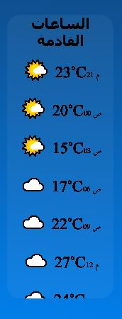
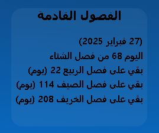
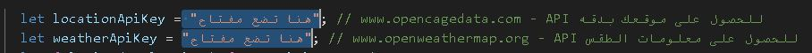

# "WeatherNow - طقسك لحظة بلحظة" ⛅🌍

"مرحبًا بك في تطبيق الطقس! 🌤️"

اكتشف حالة الطقس في مدينتك لحظة بلحظة باستخدام تطبيقنا الذكي. يوفر لك معلومات دقيقة عن درجات الحرارة، سرعة الرياح، والرطوبة، مع تحديثات مباشرة من مصادر موثوقة. لا تدع المفاجآت الجوية تفاجئك – كن دائمًا على استعداد! ⛅🌍✨    

😊

واضح مستخدم الذكاء الصناعي في المقدمه هههه

هذا تطبيق بسيط يعتمد على api  و بعض طرق استخراج المعلومات من صفحات الويب ..
الفكرة يعرض لك بطاقات كل بطاقة فيه خصائص 

مثل بطاقة الساعات القادمة و الفصول القادمه 

   
-----------------------------------------------------------------------------------------------------------------

# خطوات تشغيل الموقع بشكل صحيح 😊

افتح موقع هذا واحصل على مفتاح [openweathermap](https://openweathermap.org/api)

نفس الشي لى هذا الموقع [opencagedata](https://opencagedata.com/)

الان ضع كل مفتاح في المكان المخصص كما في الصورة تحتاج الى تعديل ملفين ملف service.js و service2.js

 ### الان فقط تفصلك خطوة واحده حتى يعمل الموقع بشكل سليم وبدون اخطاء 

 تحتاج ال بروكسي خادم حتى تتجوز المنع من بعض المواااقع [cloudflare](https://dash.cloudflare.com/)

 هذا الموقع يقدم الخدمه مجاني و البروكسي ياتي على شكل رابط الموقع جميل ويوجد فيه خدمات اخر مجااانيه....
 

 الان ضع الرابط في المكان المخصص كما في الصورة تحتاج الى وضع الرابط في كل من الملفين txtRead.js و txtReadweather.js  

-----------------------------------------------------------------------------------------------------------------
-----------------------------------------------------------------------------------------------------------------
-----------------------------------------------------------------------------------------------------------------

                                                                                                                 
                     **** جميع المفاتيح خاصه فيك لا تشاركها مع احد و البروكسي ايضاء**** 
                                                                                                                 
                                                                                                            
## مبروك عليك الموقع الان يعمل 😃 🎉 🎊

هذا واجهات الموقع 

 
